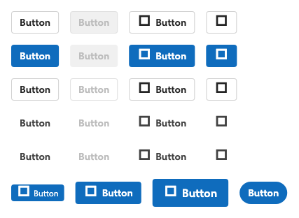
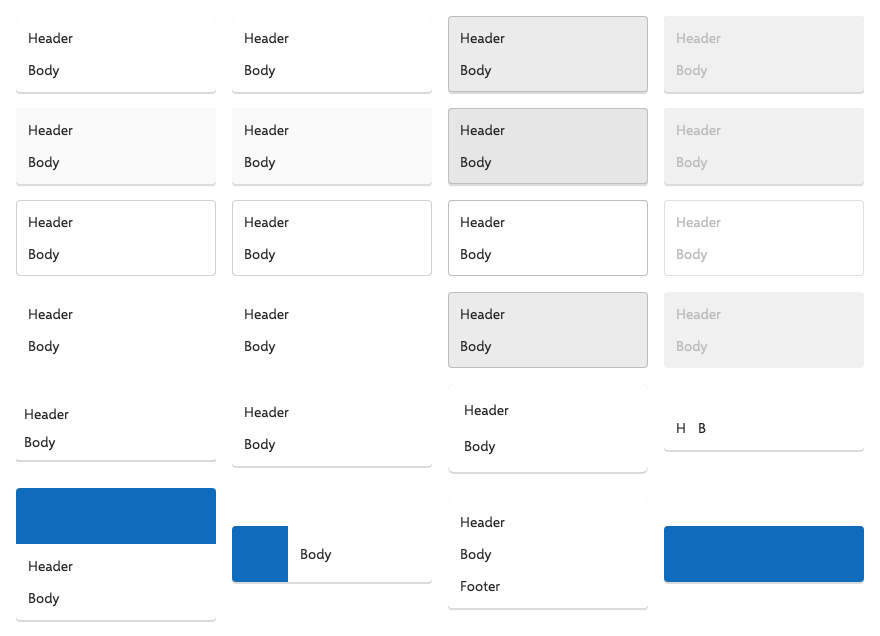
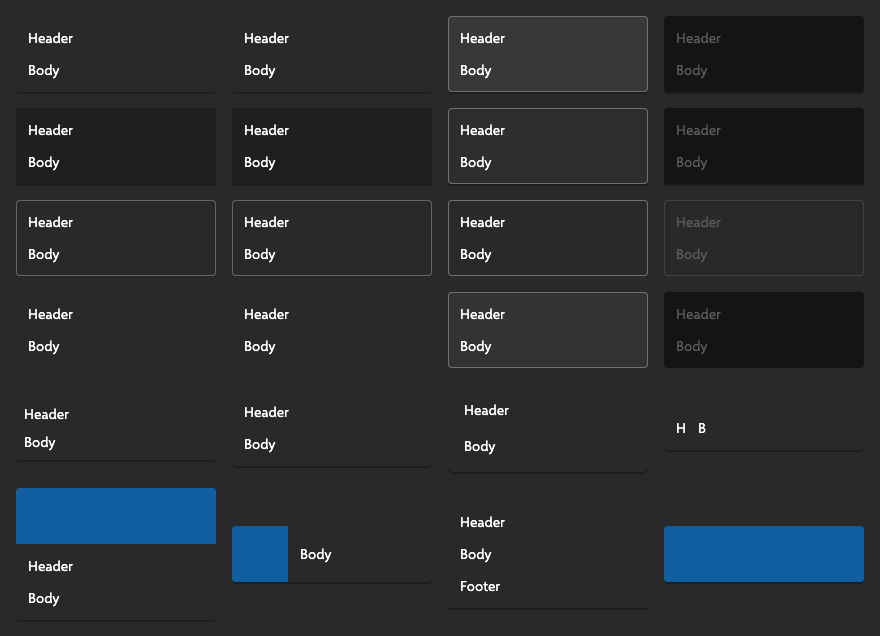
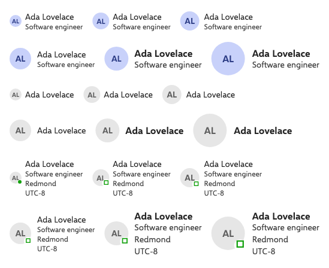
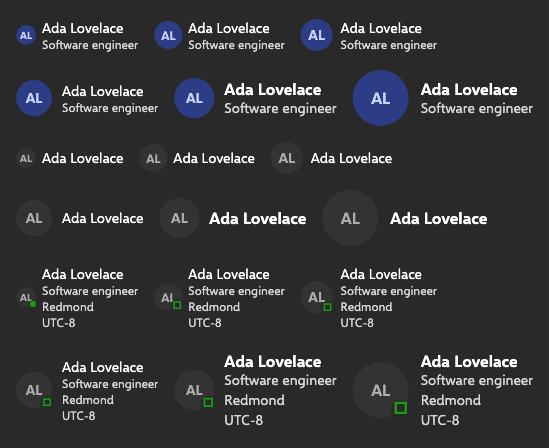
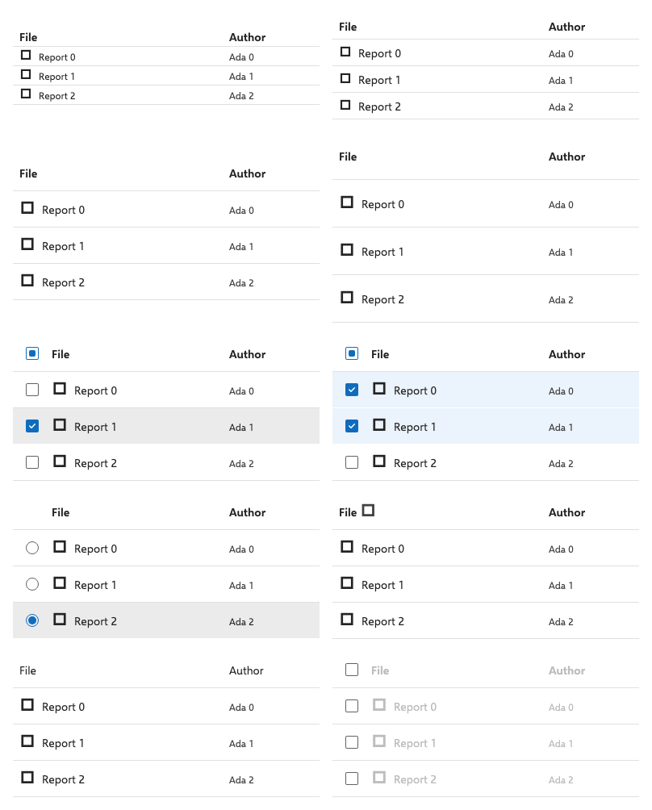
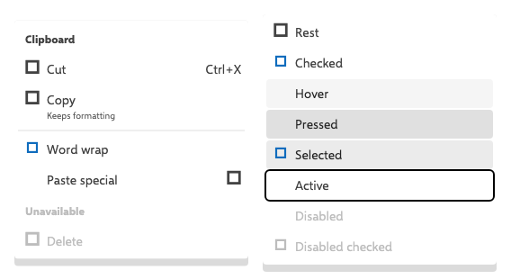
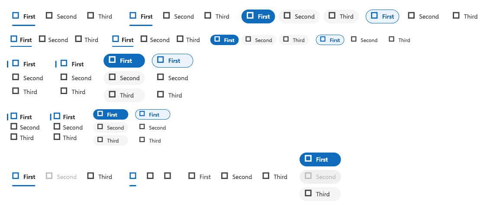
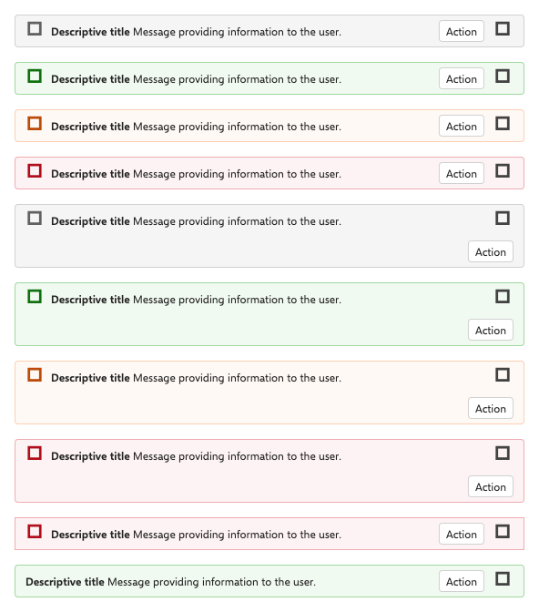
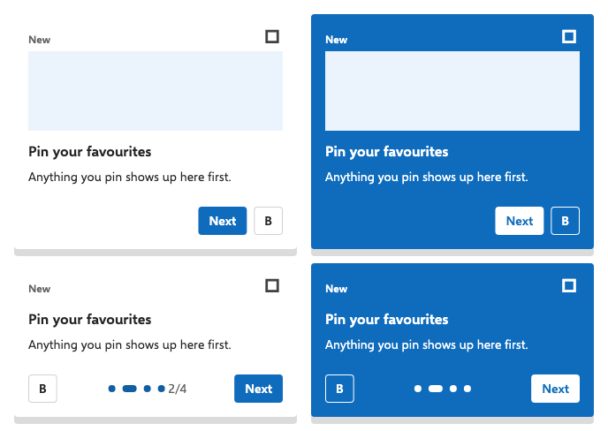

# fluent_2

Microsoft Fluent 2 design system for Flutter, as a Dart pub workspace.

> **Zero Material / Cupertino**: This system replaces Material — it does not layer on top of it. No package in this repository imports `package:flutter/material.dart` or `package:flutter/cupertino.dart`. Everything is built strictly on `package:flutter/widgets.dart`.

---

## 🎨 Component Showcase

Real Flutter component renders powered by `fluent_2`:

### Light & Dark Theme Support

| Component | Light Theme | Dark Theme |
| :--- | :---: | :---: |
| **Buttons & Controls** |  |  |
| **Cards & Surfaces** |  |  |
| **Personas & Profiles** |  |  |
| **Data Grid & Tables** |  |  |

### Interactive UI Elements

| Context & Popup Menus | Tabs & Navigation Ramps |
| :---: | :---: |
|  |  |

| Message Bars & Banners | Teaching Popovers |
| :---: | :---: |
|  |  |

---

## 📁 Workspace Layout

```text
packages/
  fluent_2_fonts/    conditional platform-font facade
  fluent_2_fonts_*/  separate Web, Windows, macOS, iOS, Android packages
  fluent_2_core/     tokens + theming + app shell   ← shared foundation
  fluent_2_web/      Fluent 2 web components & widgets
  fluent_2_mobile/   iOS / Android variants
```

Split by *surface*, not by component category — buttons/inputs/surfaces are folders inside a package. Surfaces are what actually diverge: a web button and its mobile variant are different widgets. Each UI package depends on `fluent_2_core` and re-exports it, so consumers need one import.

---

## 🚀 Quick Start & Usage

```dart
import 'package:fluent_2_web/fluent_2_web.dart';

void main() => runApp(
  FluentApp(
    theme: FluentThemeData.light(),
    darkTheme: FluentThemeData.dark(),
    themeMode: FluentThemeMode.system,
    home: const Home(),
  ),
);

// Anywhere below:
final theme = FluentTheme.of(context);
theme.colors.brandBackground;          // alias token
theme.typography.subtitle1;            // type ramp
theme.shadow(FluentElevation.shadow8); // two-layer elevation
FluentSpacing.l;                       // 16
FluentRadius.medium;                   // 4
FluentDuration.normal;                 // 200ms
FluentCurve.decelerateMid;             // entrance easing
```

---

## 🎨 Theming & Brand Ramps

Brand ramps are **generated from one key color**, not hand-picked — a Dart port of the Theme Designer algorithm (two quadratic beziers through CIE Lab, black → key color → white, sampled against a per-hue lightness table, then chroma-snapped into the sRGB gamut):

```dart
FluentThemeData.light(
  brand: FluentBrandRamp.fromKeyColor(
    const Color(0xFF7B2D8E),
    vibrancy: 0.5,    // both bezier control points; null = upstream 2/3 & 1/3
    hueTorsion: 0.2,  // rotate through neighbouring hues (-0.5…0.5)
  ),
);
```

**The generator does not reproduce Microsoft's shipped ramps.** Feeding it `#0F6CBD` matches 0 of `brandWeb`'s 16 stops, and your key color does not land on stop 80 — the lightness ladder comes from the hue table, not from the key color. `brandWeb` is hand-authored. So both exist, and the divergence is asserted in a test rather than hidden:

- `FluentBrandRamp.fromKeyColor(...)` — your own brand
- `FluentBrandRamp.web / .teams / .teamsV21 / .office / .communicationBlue` — verbatim upstream constants, for fidelity to Microsoft's real themes

The port is verified by a golden test against values captured from executing the upstream TypeScript: all 16 shades match byte for byte.

Prebuilt variants:

```dart
FluentThemeData.light();          FluentThemeData.dark();
FluentThemeData.teamsDark();      // own token table, not dark + Teams ramp
FluentThemeData.highContrast();   // 8 Windows system colors, no brand
```

Override individual tokens by subclassing `FluentColors` — every token is a virtual getter, so there is no `copyWith` plumbing:

```dart
class MyColors extends FluentColors {
  const MyColors();
  @override
  Color get brandBackground => const Color(0xFF7B2D8E);
}
```

---

## 📊 Token Sources

`fluent2.microsoft.design` publishes prose and images — `/design-tokens`, `/material` and `/motion` contain **zero numeric values**, and `/color` has no hex codes. Every value here is transcribed from the authoritative source:

| Area | Source |
|---|---|
| Colors, typography, spacing, radius, stroke, motion | `microsoft/fluentui` → `packages/tokens/src` |
| iOS ramps | `microsoft/fluentui-apple` → `GlobalTokens.swift` |
| Android ramps | `microsoft/fluentui-android` → `FluentGlobalTokens.kt` |
| Elevation luminosity equation | `fluent2.microsoft.design/elevation` |
| Acrylic constants | `microsoft/microsoft-ui-xaml` → `AcrylicBrush` |
| Brand ramp generator, 360-row hue table | `microsoft/fluentui` → `react-components/theme-designer/src` |

The Storybook at `storybooks.fluentui.dev` is also a client-rendered shell — its `index.json` lists stories but holds no token data, and the Theme docs pages are empty `<Story />` wrappers.

The type ramp follows the current Fluent 2 typography tables independently for Web, Windows, macOS, iOS, and Android. Use `fontPlatform` to preview a different ramp; otherwise `FluentThemeData` selects the build's platform automatically.

---

## 🛠️ CLI Commands

```bash
flutter pub get          # pub workspace handles resolution
melos run ci             # analyze + format + no-material + test
melos run test
```

---

## 🤖 Agent Skill Integration

Install the repository's Fluent 2 Flutter guidance with the open Agent Skills CLI. The skill uses the portable `SKILL.md` format, so the same source works with Claude Code, Cursor, Codex, and every other harness recognized by the CLI:

```bash
npx skills add B1Digital/fluent_ui_2_flutter \
  --skill fluent-2-flutter \
  --agent '*'
```

To install only selected integrations, use `--agent claude-code cursor codex`. For local development, replace the repository name with `.`.

Without the CLI, download the skill folder straight from GitHub:

```bash
# Claude Code: ~/.claude/skills — Cursor: ~/.cursor/skills — Codex: ~/.codex/skills
mkdir -p ~/.claude/skills && curl -L https://github.com/B1Digital/fluent_ui_2_flutter/archive/refs/heads/main.tar.gz \
  | tar -xz -C ~/.claude/skills --strip-components=2 'fluent_ui_2_flutter-main/skills/fluent-2-flutter'
```

A harness that implements the Agent Skills standard can also load `skills/fluent-2-flutter/SKILL.md` directly. The optional `agents/openai.yaml` adds Codex UI metadata; it does not replace or restrict the portable skill.

---

## 🚦 Package Status

- **`fluent_2_fonts`**: Selects the platform package and supplies the open-source Selawik substitute for Segoe UI on Web and Windows. Apple and Android builds use native system families.
- **`fluent_2_core`**: Supplies shared tokens, elevation models, typography, and themes.
- **`fluent_2_web`**: Contains the current web and desktop component implementation and gallery.
- **`fluent_2_mobile`**: Re-exports core (mobile component widgets in development).
